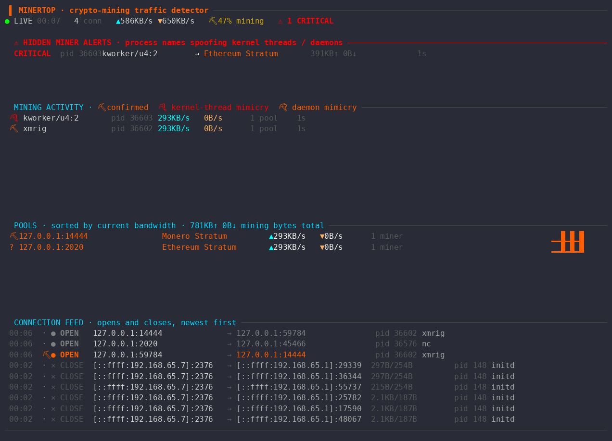

# poolnarc

<p align="center">
  <a href="https://yeet.cx"></a>
  
  <a href="#requirements">= 5.5"></a>
  <a href="https://discord.gg/vQcyYccY9"></a>
</p>

**Behavioral detector for hidden cryptominers on Linux.** Runs a scan, prints a verdict — no signature DB, no agent, no cloud.

<p align="center"></p>

poolnarc watches every outbound TCP connection at the kernel boundary with eBPF, matches destinations against a database of known mining-pool ports, and flags processes whose names lie about what they are. Built on [yeet](https://yeet.cx). Questions and ideas welcome in the [Discord](https://discord.gg/vQcyYccY9).

## Quickstart

poolnarc is an eBPF program, and [yeet](https://yeet.cx) is the runner for it: yeet compiles the program (with `clang`/`bpftool`), loads it with the kernel capabilities it needs, and streams its output — so there's nothing to set up by hand.

Install yeet once:

```sh
curl -fsSL https://yeet.cx | sh
```

Then run poolnarc straight from GitHub. No clone, no build step — yeet fetches and compiles it for you:

```sh
yeet run github:yeet-src/poolnarc -- --audit
```

Everything after `--` is passed to poolnarc itself. `--audit` runs a one-shot scan and prints a verdict; drop it for the live dashboard. On a clean host you'll see:

```
VERDICT: NO MINING ACTIVITY DETECTED
```

> The examples below are written as `yeet run main.js`, which assumes a local clone (see [Build from a clone](#build-from-a-clone)). To run without cloning, use `github:yeet-src/poolnarc` anywhere you see `main.js`.

## Use cases

- **Incident triage** — "is this box mining right now?" One command, one scan, a yes/no verdict. Nothing lands on the host beyond yeet.
- **Fleet monitoring** — cron the JSON audit (`--audit --json`) across servers and alert on any non-clean verdict.
- **Golden-image / CI checks** — scan a freshly provisioned image before it ships to catch a compromised base layer.
- **Chasing unexplained CPU** — a pegged core with no obvious owner is the classic cryptojacking tell; poolnarc names the process and the pool.
- **Confirming a suspected compromise** — verify cryptojacking on a live host without pulling it offline or touching the malware on disk.

## Why behavioral, not signatures

Most "detect cryptominer" tools hash files against a YARA or ClamAV database. They lag behind whatever's actually being deployed.

poolnarc asks two behavioral questions instead:

1. **Does the process talk to a known mining-pool port?** Stratum on 14444 for Monero, 2020 for Ethereum, the NiceHash range, and about 30 others — all in `render.js`.
2. **Is the process lying about its identity?** Real kernel threads can't open outbound TCP. If something named `kworker/u4:2` is sending bytes to a Stratum port, it's malware spoofing `comm` via `prctl(PR_SET_NAME)`.

A miner with a brand-new SHA256 still trips this. The behavior is what's invariant.

## Audit mode

One-shot scan that runs for a fixed window, prints a verdict, and exits. Outputs to stdout, pipe-friendly.

```sh
yeet run main.js -- --audit                          # 60s scan
yeet run main.js -- --audit --duration 90            # longer window
yeet run main.js -- --audit --json | tee out.json    # machine-readable
```

Sample clean output:

```
════════════════════════════════════════════════════════════════
  poolnarc audit · behavioral hidden-cryptominer scan
════════════════════════════════════════════════════════════════

  Scan started: 2026-05-31T14:18:01.234Z
  Duration:     1m 0s

── Connections observed ────────────────────────────────────────
  TCP events seen:          847
  Connections opened:       42
  Distinct destinations:    18
  Total bytes ↑/↓:          12MB / 38MB

── Mining pool detection ───────────────────────────────────────
  High-confidence mining ports:  0
  Likely Stratum ports:          0
  Overall:                       ✓ NONE

── Comm-name mimicry detection ─────────────────────────────────
  Kernel-thread name spoofing:   0
  System-daemon name spoofing:   0
  Overall:                       ✓ NO MIMICRY OBSERVED

════════════════════════════════════════════════════════════════
VERDICT: NO MINING ACTIVITY DETECTED
════════════════════════════════════════════════════════════════
```

## Live mode

For watching activity in real time. Repaints every 200ms.

```sh
yeet run main.js
```

The dashboard:

```
 ▌ POOLNARC · crypto-mining traffic detector ────────────────────────────────────────────────────────────────────
● LIVE 00:24   3 conn   ▲180KB/s ▼42KB/s   ⛏ 96% mining   ⚠ 1 CRITICAL · 0 susp

  ⚠ HIDDEN MINER ALERTS · process names spoofing kernel threads / daemons ──────────────────────────────────────
  CRITICAL  pid 8821 kworker/u4:2     → Ethereum Stratum         1.2MB↑ 340KB↓        12s

  MINING ACTIVITY · ⛏ confirmed  ⛏! kernel-thread mimicry  ⛏? daemon mimicry ────────────────────────────────────
   ⛏! kworker/u4:2     pid 8821    160KB/s   38KB/s    1 pool   12s
   ⛏  xmrig            pid 4231    18KB/s    4KB/s     1 pool   24s

  POOLS · sorted by current bandwidth · 2.4MB↑ 720KB↓ mining bytes total ────────────────────────────────────────
   ⛏ 142.93.124.5:2020         Ethereum Stratum    ▲160KB/s ▼38KB/s   1 miner
   ⛏ 65.21.198.20:14444        Monero Stratum      ▲18KB/s  ▼4KB/s    1 miner

  CONNECTION FEED · opens and closes, newest first ─────────────────────────────────────────────────────────────
   00:24  ⛏ ● OPEN  10.0.0.12:51932          → 142.93.124.5:2020    pid 8821 kworker/u4:2
   00:24  ⛏ ● OPEN  10.0.0.12:51931          → 65.21.198.20:14444   pid 4231 xmrig
─────────────────────────────────────────────────────────────────────────────────────────────────────────────────
```

HIDDEN MINER ALERTS appears only when there's something to show. Two tiers: CRITICAL when `comm` matches a kernel-thread prefix (kworker, ksoftirqd, swapper, ...), suspicious when it matches a daemon prefix (systemd, dbus, cron, ...).

Anonymize identifying details before sharing a screenshot:

```sh
yeet run main.js -- --anonymize
```

## Verify it works

`tests/simulate_attack.sh` launches a fake mining pool on `127.0.0.1:14444` plus a Python process that renames itself to `kworker/u4:2` and pumps Stratum-shaped traffic at the pool. Same `prctl` syscall the Kinsing family uses.

```sh
# shell 1
yeet run main.js -- --audit --duration 20

# shell 2
./tests/simulate_attack.sh
```

After 20 seconds the audit prints:

```
VERDICT: CRITICAL — hidden cryptominer detected
  1 process(es) talking to mining pools while spoofing kernel-thread names.
```

Ctrl-C the simulator when you're done. You've verified the detection without touching real malware.

## Evasion paths

The detector is not magic. These are real ways to defeat it, and you should know them:

- Custom mining pools on non-standard ports. The port DB covers public-pool defaults. A private pool on port 443 looks like HTTPS. The fix is pairing poolnarc with allowlist-based egress filtering.
- Non-spoofed process names. A miner that calls itself `nginx-worker` doesn't trip mimicry detection. It still shows up in MINING ACTIVITY, just not promoted to CRITICAL.
- Stratum-over-TLS on port 443. Same problem as above. TLS doesn't matter for the port-based classification; the port choice does.
- Long-lived connections that started before the scan. poolnarc sees them only when they next transition state (or move bytes). The BYTES path catches active traffic, but a miner with a long-idle socket waiting for the next block won't trigger an OPEN event mid-scan.

## Real-world incidents

- [Kinsing](https://en.wikipedia.org/wiki/Kinsing). Active 2020-present. Spreads through misconfigured Docker / Redis / SaltStack. Renames itself to look like a kernel thread.
- TeamTNT. 2020-2022 campaigns against cloud Linux. XMRig disguised as system processes.
- Sysrv-hello. Go mining worm. Same masquerade pattern.

Common pattern: outbound to public pools + comm camouflage. That's what poolnarc targets.

## Under the hood

Three BPF programs feed one ring buffer:

| program           | hook                          | does what                                           |
|-------------------|-------------------------------|------------------------------------------------------|
| `on_set_state`    | `tp_btf/inet_sock_set_state`  | track at ESTABLISHED, reap at CLOSE                  |
| `on_sendmsg`      | `fentry/tcp_sendmsg`          | tx bytes; pid fixup in app context                   |
| `on_cleanup_rbuf` | `fentry/tcp_cleanup_rbuf`     | rx bytes; pid fixup in app context                   |

One HASH map (`conns`, keyed by sock pointer) holds per-conn state and cumulative byte counts. One RINGBUF (256 KiB) carries OPEN, BYTES (delta every 64 KiB), and CLOSE to JS. Uses libbpf BTF relocations; no fixed offsets; CO-RE.

Mining intelligence (port DB, mimicry detection, alert ranking, verdict logic) is all JavaScript. Adding a pool port is a one-line patch to `render.js`.

```
main.js         entry. dispatches live vs audit, BPF bind + subscribe
state.js        connection model, aggregators, mimicry detection
audit.js        one-shot scan + report (human + JSON)
render.js       ANSI, formatters, mining pool port database
dashboard.js    panels and layout for live mode
```

## Requirements

- Linux ≥ 5.5 (for `fentry` and `tp_btf`). Debian 13, Ubuntu 22.04+, Fedora 36+, recent Arch.
- Kernel BTF (`CONFIG_DEBUG_INFO_BTF=y`), default on the above.
- `CAP_BPF` + `CAP_PERFMON`. yeet handles this.
- `clang` and `bpftool` for the BPF object. `yeet run` invokes them on first launch.

## Build from a clone

To build from a local checkout instead:

```sh
git clone https://github.com/yeet-src/poolnarc
cd poolnarc
make
yeet run main.js
```

`make clean` removes `bin/`. `make distclean` also removes `include/vmlinux.h`.
